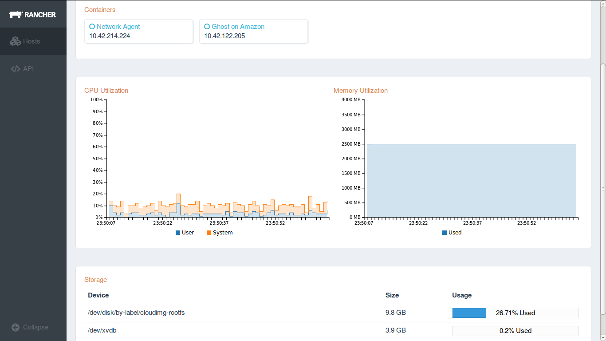

#Rancher

Rancher is an open source project that provides a complete platform for operating Docker in production. It provides infrastructure services such as multi-host networking, global and local load balancing, and volume snapshots. It integrates native Docker management capabilities such as Docker Machine and Docker Swarm. It offers a rich user experience that enables devops admins to operate Docker in production at large scale.

## Why?

Developers and operations teams love Docker because it provides a consistent computing platform that extends the entire devops life cycle, from laptop, QA, pre-production, to production environment. Rancher additionally implements consistent networking and storage services for Docker containers to operate on any bare-metal servers, VMware clusters, and public/private clouds. By integrating Rancher’s networking and storage services with native Docker management capabilities in an intuitive UI, Rancher offers a complete production platform for Docker.

## Installation

Rancher is deployed as a set of Docker containers.  Running Rancher is a simple as launching two containers.  One container as the management server and another container on a node as an agent.  You can install the containers in following approaches.

* [Manually](#installation)
* [Vagrant](#vagrant)
* [Puppet](https://github.com/nickschuch/puppet-rancher) (Thanks @nickschuch) 

### Requirements

* Docker 1.4.1+
* Ubuntu 14.04 or CoreOS 494+
    * *Note: These are the only tested distributions at the moment, but most modern Linux distributions will work*

### Management Server

    docker run -d -p 8080:8080 rancher/server

The UI and API are available on the exposed port `8080`.

### Register Nodes
 
In order to add nodes, access the UI and click on "Add Host" to find the command in the Custom option. 
 
Make sure that any security groups or firewalls allow traffic from the internet to the node on `TCP` ports `9345` and `9346`.

Also, compute nodes must be able to communicate with each other on UDP ports `500` and `4500`.  This allows Rancher to create ipsec tunnels between the nodes for networking.

> **Note:** If you are running on OS X and try the UI command and get this message: 
```bash
FATA[0000] Post http:///var/run/docker.sock/v1.17/containers/create: dial unix /var/run/docker.sock: no such file or directory. Are you trying to connect to a TLS-enabled daemon without TLS?
```
please retry the command without sudo.

## UI

The UI is available by accessing the base HTTP URL of the management server.  For example, `http://MANAGEMENT_IP:8080/`



## API

The API is available by accessing the `/v1` HTTP path of the management server.  For example, `http://MANAGEMENT_IP:8080/v1`

Rancher has its own API for infrastructure management tasks.  For Docker related operations, the intention is to support the Docker CLI.  That work is currently in progress.

### Vagrant

If you want to use Vagrant to run this on your laptop just clone the repo and to do `vagrant up` and then access port 8080 for the UI.

## Status

We've just recently kicked off this project.  Currently Rancher is able to provide a basic implementation of overlay networking and cross-server Docker links.  A lot of work has been done to put in a solid orchestration platform to control all the functionality we wish to do.  Now that that framework is in place expect this project to produce a high amount of features over the next six months.

## Source Code

This repo is a meta-repo used for packaging.  The source code for Rancher is in other repos in the rancherio organization.  The majority of the code is in https://github.com/rancherio/cattle.

## Planned

* Storage
    * Docker volume management (create, delete, list)
    * Volume snapshot
    * Snapshot backup to S3/Object Store
    * Create volume from snapshot
* Networking
    * Security groups
    * Load balancing

## Support, Discussion, and Community
If you need any help with Rancher or RancherOS, please join us at either our [rancherio Google Groups](https://groups.google.com/forum/#!forum/rancherio) or [#rancher IRC channel](http://webchat.freenode.net/?channels=rancher) where most of our team hangs out at.

Please submit any **Rancher** bugs, issues, and feature requests to [rancherio/rancher](//github.com/rancherio/rancher/issues).

Please submit any **RancherOS** bugs, issues, and feature requests to [rancherio/os](//github.com/rancherio/os/issues).

#License
Copyright (c) 2014-2015 [Rancher Labs, Inc.](http://rancher.com)

Licensed under the Apache License, Version 2.0 (the "License");
you may not use this file except in compliance with the License.
You may obtain a copy of the License at

[http://www.apache.org/licenses/LICENSE-2.0](http://www.apache.org/licenses/LICENSE-2.0)

Unless required by applicable law or agreed to in writing, software
distributed under the License is distributed on an "AS IS" BASIS,
WITHOUT WARRANTIES OR CONDITIONS OF ANY KIND, either express or implied.
See the License for the specific language governing permissions and
limitations under the License.

